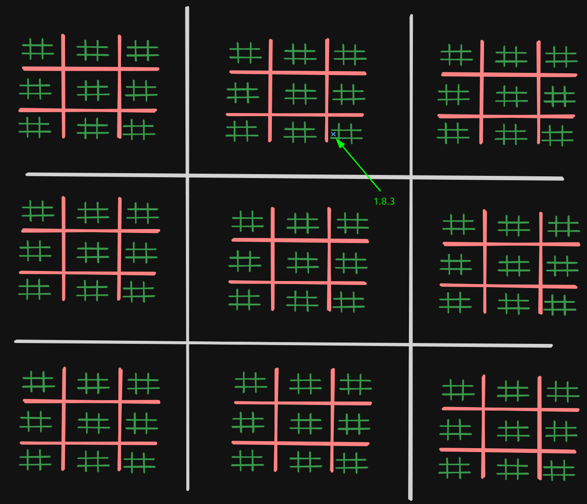
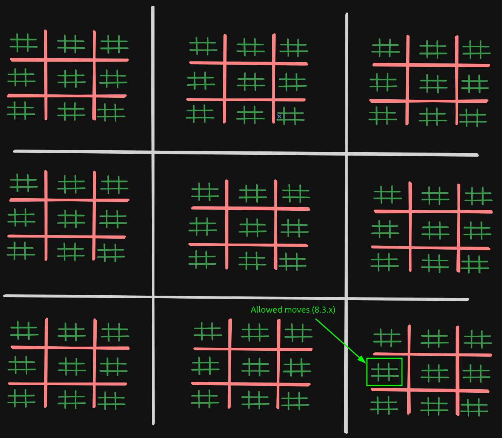

# Ultimate Tic-Tac-Toe

Ultimate Tic-Tac-Toe is an advanced version of the traditional Tic Tac Toe game.

It introduces additional complexity by expanding the game board and adding new rules.
This makes the game more challenging requiring players to think several moves ahead and consider multiple levels of strategy.

You can find the full rules [here](https://en.wikipedia.org/wiki/Ultimate_tic-tac-toe).

## Game Board

The game board is a 3x3 grid, where each cell can be in 5 different states:
- Empty
- Circle
- Cross
- Both (if a sub-grid ends in a draw, its value becomes both cross and circle, so both players can use it to win.)
- Contains a small 3x3 Tic Tac Toe grid

## Objective

The objective is to align 3 of your pieces in a row, column or diagonal on the main board.
*In exactly the same way a traditional game of Tic Tac Toe is won.*

## Rules
/!\\: The player can only play in the deepest level of a cell. If a cell is a subgrid, a player cannot override the whole subgrid with their piece.

**Initial move:** The first player can place their piece in any of the deepest levels of the oard.

**Subsequent moves:** The location of the next move is determined by the move that was just played, guiding the opponent to play in a specific board.

*The move sequence consists of indices representing the path though the grid hierarchy.*

**Forced Move Mechanics:**
- Each move dictates the subgrid in which the next player must play. If a player makes the move `a.b.c`, the next player will be required to play in the subgrid specified by `b.c`, choosing any cell within that subgrid.
- If a move directs the opponent to a cell that corresponds to a board that has already been won (or is full), the opponent can play in any of the remaining available cells.

Illustration Example:

Let's imagine we are playing on a grid with levels of depth. Player 1 makes a move in the cell `1.8.3`, which means he is playing in subgrid 2,
then in subgrid 8 within subgrid 1, and finally in cell 3 within subgrid 8.

As a result, Player 2 has to make his next move with subgrid 3 of subgrid 8 (see image below);

**Winning a board at any depth:**
- A grid is won by the standard Tic Tac Toe rules: completing a row, column or diagonal within that grid.
- If a grid ends in a draw, the grid is marked as both circle and cross. Any of the players can use this cell to win the higher level grid.

## Technical documentation
We have put together some documentation to explain some of the concepts behind our project. You can find it [here](./docs/README.md).

# Authors
- DRAESCHER Lucas (Reviewer)
- DUSART Victor
